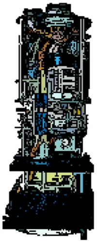

# tranlang
TranLang - CGI-based Language Translation for Static Web Content

Renders statically-generated HTML content, and dynamically translates content to a user's preferred language.  The language can be detected by the 'HTTP_ACCEPT_LANGUAGE' HTTP header sent by the client's browser, or set manually via the 'lang=' parameter in the URL query string.  If supplied with appropriate API keys, the software will attempt to translate using DeepL, and then by using Google.  To eliminate page generation latency and API service charges, TranLang will cache pages that have been translated and only re-translate them if they have been updated.  When viewing web content with TranLang, users will be presented with a collapsible toolbar at the top of the page to give them control over which language is presented.

### TODO:
- _Page toolbar_  - The toolbar is missing functionality and graphics.
- _Robots tool_   - Generate robots.txt for all translation combinations so web crawlers can index pre-translated content.
- _Data chunking_ - DeepL/Google queries are 128K/100K respectively. Huge requests need to be broken on the sentence boundary.

_Version 0.2 (27 December 2021)_
